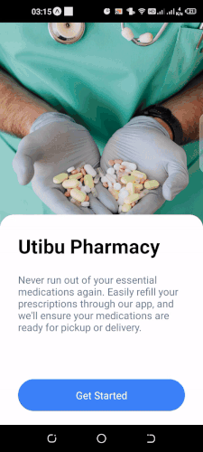

# Community Pharmacy App

## Description

Community Pharmacy App is a mobile application designed to help users manage their medication orders and refills conveniently from their smartphones. With features like medication browsing, ordering, and order tracking, users can easily stay on top of their prescriptions and never miss a refill.

## Features

- Browse and search for medications by name, category, or condition.
- View detailed information about each medication, including description, dosage, price, and stock availability.
- Place medication orders.
- Refill prescriptions with a single tap.
- Manage user profile, preferences, and notification settings.
- View order history and reorder medications easily.
- Receive notifications for order updates.

## Installation

To run the Community Pharmacy App locally on your machine, follow these steps:

1. Clone the repository: `git clone git@github.com:smsharon/community-pharmacyApp.git`
2. Navigate to the project directory: `cd community-pharmacyApp`
3. Install dependencies: `npm install`
4. Run the app: `npm start`

## Usage

1. Open the app on your mobile device or emulator.
2. Sign in or create an account to access the full features.
3. Browse medications, place orders, and manage your profile.
4. Receive order updates and refill reminders.

## Demo

## Technologies Used

.React Native
.Firebase Realtime Database
.Firebase Authentication
.Expo
## Contributing

Contributions are welcome! To contribute to the Community Pharmacy App, follow these steps:

1. Fork the repository.
2. Create a new branch: `git checkout -b feature-branch`
3. Make your changes and commit them: `git commit -am 'Add new feature'`
4. Push to the branch: `git push origin feature-branch`
5. Submit a pull request.

## License

This project is licensed under the MIT License
